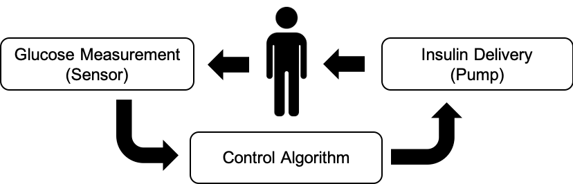
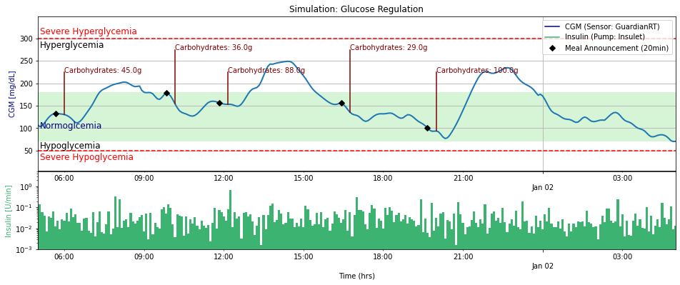

.. _problem:

Glucose Control Problem
============

Type 1 Diabetes (T1D)
-------------

Type 1 Diabetes (T1D) requires the administration of insulin externally to maintain glucose levels, which is cruicial as both low and high glucose levels are detrimental. 

Artificial Pancreas System (APS)
-------------

This is usually done through an insulin pump attached to the body. An continuous glucose sensor is also attached to measure the glucose levels so that a control algorithm can estimate the appropriate insulin dose. The figure below represents the main components of an Artificial Pancreas System (APS) to treat T1D.

Maintaining glucose levels is a life-long optimisation problem, complicated due to the disturbances associated with daily events (meals, exercise, stress.. etc), delays present in glucose sensing and insulin action, partial observability, and safety constraints among others. Below you can see a simulated glucose control strategy of a RL algorithm.

