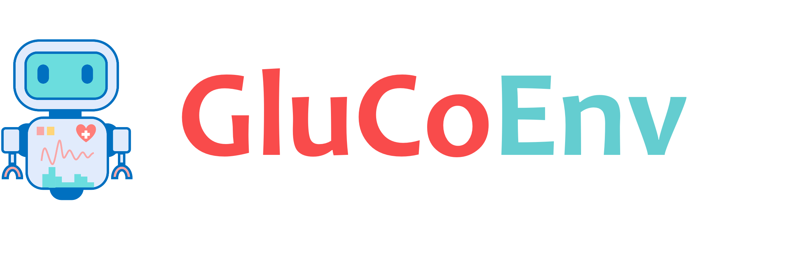

.. _Simglucose: https://github.com/jxx123/simglucose
.. _CAPSML: http://capsml.com/
.. _torchdiffeq: https://github.com/rtqichen/torchdiffeq
.. _torchcubicspline: https://github.com/patrick-kidger/torchcubicspline

Welcome to GluCoEnv documentation!
===================================

**GluCoEnv - Glucose Control Environment** is a simulation environment which aims to facilitate the development of Reinforcement Learning based Artificial Pancreas Systems for Glucose Control in Type 1 Diabetes. 

About
------------

This project implements in-silico Type 1 Diabetes (T1D) subjects for developing glucose control algorithms. The glucose control environment includes 30 subjects (10 children, adolescents, and adults each), which extends the work of `Simglucose`_ and UVA/Padova 2008 simulators by following an end-to-end GPU-based implmentation using the PyTorch framework. The project aim is to facilitate the development of Reinforcement Learning (RL) based control algorithms by providing a high-performance environment for experimentation. 

Research related to RL-based glucose control systems are relatively minimal compared to popular RL tasks (games, physics simulations etc). The task of glucose control requires ground up development where prolem formulations, state-action space representations, reward function formulations are not well established. Hence, researchers have to run significant amount of experiments to design, develop and tune hyperparameters. This groundup development requires significant compute and effort. 

The key highlights of **GluCoEnv** are the vectorized parallel environments designed to run on a GPU and the flexibility to develop RL-based algorithms for glucose control and benchmarking. The problem also lacks proper benchmarking scenarios and controllers, which have been implemented in this environment to provide some guidance on the task.

You can find more details and our RL-based glucose control algorithms by visiting the project `CAPSML`_.

.. warning::

   This project is under active development.

Contents
--------

.. toctree::
   :maxdepth: 2
   :caption: User Guide
   
   guide/install
   guide/problem
   guide/environment
   guide/state
   guide/action
   guide/reward
   guide/benchmark
   guide/metrics
   guide/visualisation
   guide/resources
   
   
.. toctree::
   :maxdepth: 2
   :caption: Control Algorithms
   
   algo/sbb
   algo/ppo
   algo/G2P2C

Learn More 
--------

You can learn more about RL-based glucose control by visiting the project `CAPSML`_.
RL-based systems, I have designed are hosted there, which provides you the ability to simulate for your own custom scenarios.

Citing GluCoEnv
--------
To cite this project in publications:

.. code-block:: bibtex

   @misc{hettiarachchi2022glucoenv,
     author={Hettiarachchi, Chirath},
     title={GluCoEnv v0.1.0(2022)},
     year = {2022},
     publisher = {GitHub},
     journal = {GitHub repository},
     howpublished = {\url{https://github.com/chirathyh/GluCoEnv}},
   }

Acknowledgement
--------

The UVA/Padova model made it possible to design / develop control systems for glucose regulation in Type 1 Diabetes, in an in-silico manner. However, it was designed for the Matlab framework. The development of the `Simglucose`_ simulator by Jinyu Xie, has been a very valuable contribution to research for the development of Reinforcement Learning based control systems. I would like to thank everyone behind all these efforts.

The open-source community projects Python, PyTorch, `torchdiffeq`_, `torchcubicspline`_ was heavily used in this work. I thank all the developers behind these projects, the Stack Overflow, PyTorch communities who have been very helpful the development of this work.  

This project initiated as a hobby project of Chirath Hettiarachchi, who is currently a PhD student whose research is funded by the Australian National University and the Our Health in Our Hands initiative; and by the National Computational Infrastructure (NCI Australia), and NCRIS enabled capability supported by the Australian Government. 
